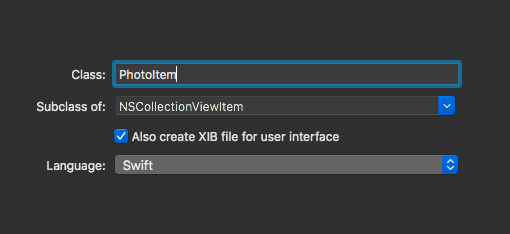

# Swift & XCode Notes

### NSViewControllers

This is the base class used to extends all the view controller classes you will need for the views.

### Associate a window with a view controller

To create the association in IB between the Window Controller and your View Controller, you have to click on the "Window Controller", hold the `Control` key, and drag it to the View Controller you want to associate to it.


### Assign a class to a view controller

To associate a class to a view controller, simply click on the view controller, and then on the options bar, select your class under the `Custom Class > Class` input as shown in the image:


### Enable resizing

To allow resizing of the view, you need to select `View Controller Scene` for your controller, then `Editor`, and in the menu select `Resolve Auto Layout Issues > Reset to Suggested Constrains`.


### Associate Table View to the View Controller Class

Click on the `Table View` object, then hold `Control` and drag it to the `View Controller`, and in the menu that will appear there, select `dataSource`, repeate the same procedure again, and select `delegate` this time.


Also after you linked it on IB, the next thing to do is to add the classes to extend your view controller class as well, so for example as we added the `dataSource` and the `delegate`, just add the `NSTableViewDataSource` and `NSTableViewDelegate`, as shown below:

```swift
import Cocoa

class ViewController: NSViewController, NSTableViewDataSource, NSTableViewDelegate {
	func tableView(_ tableView: NSTableView, shouldSelectRow row: Int) -> Bool {
        return false
    }
    ...
}
```


### IBOutlet and IBAction

The `IBOutlet` which can be created by selecting the outlet (eg. a TextField), holding `Ctrl` and dragging it into ViewController class. This is where you want to connect with data inputs or table data views for example, it associate a variable to an object essentially. 

The `IBAction` instead is when you want to associate an object, for example a push button, to a function to execute.

To view both the `Storyboard` and the Code associated with the `View`, you can simply click on the `Assistant Editor` icon:


### Segmented controls

The **Segmented controls** are essentially group of buttons, each button will form an array for segments, so `selectedSegment == 0` it's used to check if the first button is selected for example.
You can create a segmented control via code using the `NSSegmentedControl` method, here a quick example:

```swift
// load the back and forth images
let back = NSImage(named: NSImage.touchBarGoBackTemplateName)!
let forward = NSImage(named: NSImage.touchBarGoForwardTemplateName)!
// create a segmented control out of them, calling our navigationClicked() method
let segmentedControl = NSSegmentedControl(images: [back, forward], trackingMode: .momentary, target: self, action: #selector(navigationClicked))
```


### Get enumerated arrays

If you have an array like `["orange", "banana",  "peach"]`, you can loop against it with the `for ... in` loop, like this:

```swift
let fruits = ["orange", "banana",  "peach"]
for fruit in fruits {
    // orange
    // banana
    // peach
}
```

But this will not tell you the index of each of the items in the array. To get it you will need to use the `.enumerated` property of the array:

```swift
let fruits = ["orange", "banana",  "peach"]

for (index, fruit) in fruits.enumerated() {
    // 0, orange or [0] = "orange"
    // 1, banana [1] = "banana"
    // 2, peach [2] = "peach"
}
```


### NSImage

The `NSImage` can be used to either load an image from the bundle, using `NSImage(named:)` or `NSImage(contentsOf:)` which can accept an URL for an image, like a file from where the app computer is running from.


## Enable Drag & Drop from Finder with CollectionView

To enable drag and drop of files into your App, you will need to add this line of code from the ViewController class and to call the `collectionView` with the delegate method specified below:

```swift
class ViewController: NSViewController, NSCollectionViewDataSource, NSCollectionViewDelegate {

    @IBOutlet var collectionView: NSCollectionView!
    override func viewDidLoad() {
        super.viewDidLoad()
        // this tells the collectionView to accept Drag & Drop
        collectionView.registerForDraggedTypes([NSPasteboard.PasteboardType.fileURL])
    }
    
    // this will tell to macOS to move the files into the user directory defined
    func collectionView(_ collectionView: NSCollectionView, validateDrop draggingInfo: NSDraggingInfo, proposedIndexPath proposedDropIndexPath: AutoreleasingUnsafeMutablePointer<NSIndexPath>, dropOperation proposedDropOperation: UnsafeMutablePointer<NSCollectionView.DropOperation>) -> NSDragOperation {
        return .move
    }
}
```


## Webkit


### App Transport Security

By default the Webkit library allows only **https** calls and denies all the insecure calls. To change that, open the `info.plist` file, add a new row, and select `App Transport Security Settings`, from there you need to add a subrow and select `Allow Arbitrary Loads in Web Content` and change its value from `No` to `Yes`

 


## Mark methods available only from specific version of macOS onwards

To mark that a method is available only from a specific version of macOS, such something regarding the Touch Bar, you just need to use the `@available` property, something like this:

```swift
@available(OSX 10.12.2, *)
func touchBar(_ touchBar: NSTouchBar, makeItemForIdentifier identifier: NSTouchBarItem.Identifier) -> NSTouchBarItem? {
	// your code
}
```


## CollectionView

A collection view is similar to a GridView, but with the option to add anything you want as an item.
Once you have imported the CollectionView to the ViewController (adding `delegate` and `dataSource` via `ctrl+drag`), you will need to create the item, and to do so you will need to create a new file, use the `NSCollectionViewItem` class as subclass, and **check the `Also create XIB file for user interface`**.

 

This will create two files, a `.swift` class file, and an `.xib` file, but to associate your class to the xib file, you will need to get the `Collection View Item` from the objects library, drag it to the sidebar where the view objects lives, this will create a new Object, which then you need to associate with the class.


## Creating a generic class

To create a generic class, what you need to do go to the File menu, `New -> File`, select `Cocoa Class`, give the name of the class you want to create, and then use the subclass `NSObject`.


## Running code on the background

### `performSelector`

A simple wayt to perform a function on the background is to use the `performSelector` function, which can be used to run functions on the main thread or in a background one, here some simple example:

```swift

class ViewController: NSViewController {

    override func viewDidLoad() {
        super.viewDidLoad()
        runBackgroundCode1()
    }
    
    @objc func log(message: String) {
        print("Priting message: \(message)")
    }

    func runBackgroundCode1() {
    	performSelector(inBackground: #selector(log), with: "Hello world 1")
        performSelector(onMainThread: #selector(log), with: "Hello world 2", waitUntilDone: false)
        log(message: "Hello world 3")
     }
}
```


### `perform`

This can be used to run a method after a delay of X seconds, here an example:

```swift
perform(#selector(log), with: "Hello world", afterDelay: 1)	
```


### GCD

The **GCD**, or **Grand Central Dispatch**, it's used to run part of the application concurrently on multicore hardware by submitting the work to dispatch queues, it can be use to run async or sync jobs. 
To run work asynchronously, you use `DispatchQueue`, then a queue name, then call `async()`. This uses trailing closure syntax, which makes your method call look like a code block. You provide the code you want to run as a closure (similar to callbacks on promises in JavaScript).
A very simple example:

```swift
DispatchQueue.global().async { [unowned self] in 
    self.log(message: "On Background thread")

    DispatchQueue.main.async {
        self.log(message: "On main thread")
    }
}
```

 

Here you will see that the first function will use the global thread to execute the function, the `[ unowned self]` is a reference to the main object, which is not needed on the second async call as it's implicitly declared for it. The second function will be then executed from the main thread (where the application runs).

The `.global` queue can have different priority defined by the `qos` parameter (Quality of Service), and has these following priority levels:

```swift
// Highest priority, for important work
DispatchQueue.global(qos: .userInteractive).async
// 2nd highest priority work
DispatchQueue.global(qos: .userInitiated).async
// For long running tasks in the background
DispatchQueue.global(qos: .utility).async
// For long running tasks in the background the user does not care about right now
DispatchQueue.global(qos: .background).async
```

To run an async function after a delayed amount of time, you can do this instead

```swift
DispatchQueue.main.asyncAfter(deadline: .now() + 1) { [unowned self] in 
	self.log(message: "Hello world")
}

// Or using the global process
DispatchQueue.global().asyncAfter(deadline: .now() + 1) { [unowned self] in 
	self.log(message: "Hello world")
}
```


#### Concurrent execution

To run some code with concurrent execution, which means the work can be spread across the various threads of the CPU, you can use the `concurrentPerform()` function.

For example to run a concurrent code 10 times, which will be managed by the GCD (which will take take to spread the work to whatever number of threads can access), you can do something like this:

```swift
func runMultiProcessing1() {
    DispatchQueue.concurrentPerform(iterations: 10) {
        print($0); // the $0 it's a special variable that holds the current iteration
        // will print randomly numbers between 0 and 9
    }
}
```


### UserDefaults

The `UserDefaults` class is used for loading and saving small amount of user settings, where by *small* it generally means at about 1MB, there's no hard limit (apart on tvOS where you have a limit of 512KB), but it's common sense not to go above that amount of space.

> `UserDefaults` is not safe, so never store passwords or sensible information on this class

`UserDefaults` automatically detects what kind of data you're trying to save, so it has one method called `set(_:forKey)` that lets you write as much data as you need. Example:

```swift
let defaults = UserDefaults.standard // Standard this is the default one, but you can create your own
defaults.set(5, forKey: "My favourite number")
let myFavouriteNumber = defaults.integer(forKey: "My favourite number")
```


### Fetch data over the internet

To fetch data over the internet you can use the `String(contentsOf: url)` class. This is going to retrieve and stop the execution until it's done, so you shouldn't put in the main thread as it might result in the app to freeze until the execution is done. Best approach is to use the `DispatchQueue`. Here an example:

```swift
guard let url = URL(string: "http://www.someapi.com")

DispatchQueue.global(qos: .utility).async { [unowned self] in
	guard let data try? String(contentsOf: url) else { return false }
	// data now contains the content, if any was found, otherwise it will be nil
}
```


### NotificationCenter
The `NotificationCenter` class is responsible for sending and receiving messages across the app. We could, if we wanted, make some sort of direct method callback using a custom delegate, but settings changes should be global, so this method is preferred.


## Use cases

### `NSOpenPanel`: Selecting a file from the system

To select a file the very first thing is to create an instance of  the`NSClickGestureRecognizer` class. This is the class that takes care of click gestures. Then to the *recognizer* we'll add as a selector a method that will be invoked when the user clicks on the element associated with the recognizer, an instance of `NSImageView` in our case.
The function will then use the `NSOpenPanel` class which is the one that will open the file selection, and has several options you can pass, like which file types to allow, allow multiple selection, etc...

```swift
import Cocoa

class ViewController: NSViewController {
    @IBOutlet var imageView: NSImageView!
    var mySelectedPhoto: NSImage?

    override func viewDidLoad() {
        super.viewDidLoad()
        // this tells what to do on click
        let recognizer = NSClickGestureRecognizer(target: self, action: #selector(selectPhoto))
        // this associate the click gesture to the image view object
        imageView.addGestureRecognizer(recognizer)
    }
 	
    @objc func selectPhoto() {
        let panel = NSOpenPanel()
        // we tell to the panel to only allow jpg and png file extensions
        panel.allowedFileTypes = ["jpg", "png"]
        // we tell to open the file selection, and we pass a closure function 
        // to be executed when a user selected a file
        panel.begin { [unowned self] result in
            // if resuls.rawValue is equal to 1, which means that
            // the user pressed the OK button, or 0 if the user 
            // pressed the cancel button
            if result.rawValue == 1 {
                guard let imageURL = panel.url else { return }
                // we store the value of the URL of the selected photo
                self.mySelectedPhoto = NSImage(contentsOf: imageURL)
            }
        }
    }
}
```


#### `NSSavePanel`: Saving a file or selecting a save folder

This process is very similar to the one above, in fact the `NSSavePanel` class is the parent class of `NSOpenPanel` and it's used in the same exact way.

```swift
func selectSavePath() {
        let panel = NSSavePanel()
        // we tell to open the file selection, and we pass a closure function 
        // to be executed when a user selected a file
        panel.begin { [unowned self] result in
            // this is alternative to checking the .rawValue, you can use the .OK constant
            if result == .OK {
                guard let savePath = panel.url else { return }
                // do whatever you want with the path
            }
        }
    }
```


Be aware that if you want to allow files to be saved, if you sandbox your application, you need to enable the `Read/Write` permission in the Project `Capabilities` settings.


### Call custom function on menu item 

If you want to execute a custom function from a menu item it's easy enough, but you need to do a few steps:

##### Create your custom function

In your View Controller, add a function with the `@IBAction` property:

```swift
@IBAction func doMyStuff(_ sender: Any) {
    // do something here
}
```

Once you have your function, you will have to go to the `Main.storyboard` file, click on `Application Scene > Main Menu` and expand the menu you want to add your custom menu item, open the **Library** and search for `Menu Item`, drag it into your menu, and here in the inspector you can change the label and assign the Key Equivalent if you desire.
Now you need to associate the Menu Item with the `First Responder`, which tells the app what to execute once the Menu Item is clicked. So select your Menu Item, `ctrl + drag` to the `First Responder`, and then you will be prompted with a list of methods to call, select your `doMyStuff` function and you are ready to go.


## Misc

### NSWorkspace
The `NSWorkspace` class is responsible for letting us work with the macOS environment, such as monitoring file and launching apps.


### Color Well

To show the opacity slider on the color well, you need to add this line of code `NSColorPanel.shared.showsAlpha = true` in the `AppDelegate.swift` code, under the method `applicationDidFinishLaunching`, so it will look like this:

```swift
import Cocoa

@NSApplicationMain
class AppDelegate: NSObject, NSApplicationDelegate {

    func applicationDidFinishLaunching(_ aNotification: Notification) {
        NSColorPanel.shared.showsAlpha = true
    }
}
```

And now you will see the opacity slider:


### Delegate classes

This is something that to me seemed a bit obscure at first, and it's kinda still is, but a usecase I found that helped me to understand the `delegate` thing in Swift, is the case when you want to link a view class to a text field contained in that view, and you want to access to some properties that are only in the NSTextView class.
So, imagine you have the case described above, the first thing to do is to select the text field, then `Ctrl+drag`to the `View Controller` in IB, a dropdown will appear and you will have to select `delegate`.


Once this is done, you can now go to your `ViewController.swift` or whatever you called the class of your View Controller, extend it with `NSTextViewDelegate` class, and this will give you access to the methods of the `NSTextView` object, so for example if you want to execute some code every time the text changes in your text field, you can call it in this way:

```swift
import Cocoa

class ViewController: NSViewController, NSTextViewDelegate {
	
	func textDidChange(_ notification: Notification) {
        // text is changed, do something
    }
}
```


## Making the app running without a window 

If you want to make your app to run without an initial window, but you want to run it from the statusbar of MacOS, you need to do two steps:

* On the Window Controller Scene, in the inspector, unselect the option `Is Initial Controller`


* In the `info.plist` file, add **a new row**, and add the option `Application is agent (UIElement)` and set the value to `YES`


---

## Gotchas

### `do...catch` is `try...catch`

To do a `try...catch` condition, in Swift is done with `do...catch`, and `try` is used inside the `do` to test teh code to try, also you have the `try!` and `try?` cases, more info [here](https://stackoverflow.com/questions/32390611/try-try-try-what-s-the-difference-and-when-to-use-each).
An example of `do...catch` is the following:

```swift
do {
    let result = try doSomething()
} catch {
    // some error here
}
```

Be aware that using a `do...catch` without a `try` inside, it will return an error.


### Null values

Unlike other languages like PHP or Javascript, to define a variable to be a **null** value, you use the keyword `nil`, so `var myVariable = nil`


### Double named arguments

In some cases you might find function that has arguments like this `func myFunction(at size:NSSize) {`, which if you come from other languages might looks odd, but the reason by is rather simple. In Swift you can label the argument twice, where the first one is used when you invoke the function, while the second is the one used inside the function, example here:

```swift
func sayHello(to name: String) {
    print("Hello " + name)
}

sayHello(to: "Pekka")
```


### `Throws` as a return type for a function/method

If you add `Throws` as the return type of a function, it means that you might try some code in your function that might fail, but the function itself is not going to handle the error which should be handled by the parent function or code that invokes it, example:

```swift
func doSomething(file: URL) throws {
    let fm = FileManager.default
    if fm.fileExists(atPath: file.path) {
        try fm.removeItem(at: file) // this might throw an error
    }
} 

// then in another method
func callDoSomething() {
    let file = URL(string: "somefile")
    
    do {
        try doSomethign(file)
    } catch {
        // we handle the error here
        print("Something went wrong")
    }
}
```

### string vs stringValue

These two methods are almost identical, the difference between the two is that `string` returns a string **optionally**, so it's up to the developer to check if it's empty or not, while `stringValue` **always return a value**, so if the variable passed is undefined or *nil*, it will return an empty string `""`.
This is the same also for `array` and `arrayValue`, `double` and `doubleValue`, `int` and `intValue` and so on.